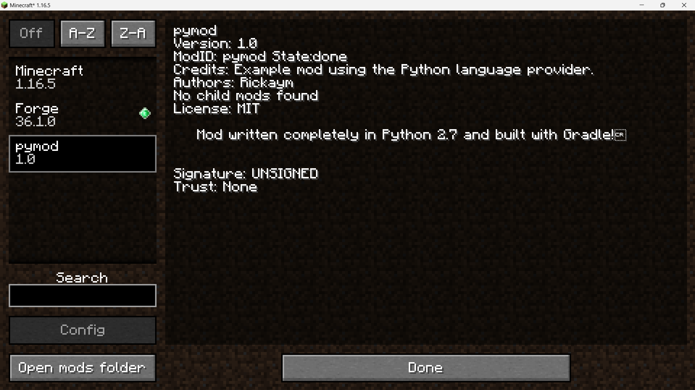

<image src="https://raw.githubusercontent.com/Rickaym/pyforge/main/docs/logo.png" style="height: 200px;"></image>

<a href="https://www.curseforge.com/minecraft/mc-mods/pyforge"></a>
<a href="https://pyforge-mc.readthedocs.com"></a>

# Getting Started

**PyForge** is a Python language provider crafted for Minecraft Forge. It leverages the Jython implementation of Python which runs on the JVM. The mod loader is compatible with CPython 2.7.x syntax and is designed to support a comprehensive implementation of a Forge Mod. 

A language provider for the Fabric Mod Loader is also in the works.

[See an example mod using PyForge here](https://github.com/Rickaym/pymod).

I created pyforge as a way to test the capabilities of Jython and potentially find a way into Minecraft modding using Python.

Read more after this at [pyforge-mc.readthedocs.io](https://pyforge-mc.readthedocs.io/en/latest/) if you are on GitHub.


> [!WARNING]
>
> Pyforge is usable at this point in time, but a lot of work still remains to be done. 

!!! warning
    Pyforge is usable at this point in time, but a lot of work still remains to be done.

## Version Support

- 1.16.5-36

## Quickstart

The directory structure of a pyforge mod is the same as that of its Java equivalent. The only difference with our mod is that the package name must be the same as the mod id rather than in Java, conventionally, `com.rickaym.mod`.  

E.g.
```python
  ┓
  ┣━ ...
  ┣━ build.gradle
  ┗━ src ┓
         ┣━ pymod ┓
         ┃        ┣━ __init__.py
         ┃        ┣━ main.py
         ┃        ┣━ ext.py
         ┃        ┗━ more_ext.py
         ┃
         ┗━ resources ┓
                      ┣━ ...
                      ┗━ META-INF ┓
                                  ┗━ mods.toml
```

### Setup

The `__init__.py` file inside the `root.src.pymod` directory serves as the entrypoint to the mod. To setup the mod, you have to define a function inside the `__init__.py` file called `get_mod_instance` that readily returns an instance of the mod.

```python
# __init__.py

from main import MyMod

get_mod_instance = lambda: MyMod()
```

To implement the mod class, decorate it with the `@Mod` decorator and define the `register` method.

```py
# main.py

import org.apache.logging.log4j.LogManager as LogManager

from rickaym.pyforge import Mod

from ext import ExtensionClass, SecondExtensionClass
from more_ext import MoreExt

@Mod(mod_id="pymod")
class MyMod:
    ...

    def __init__(self):
        self.LOGGER = LogManager.getLogger()
        self.LOGGER.info("Pymod is loaded 🐍☕")

    def register(self):
        ExtensionClass.register()
        SecondExtensionClass.register()
        MoreExt.register()
```

Finally, you need a mods.toml file that describes the mod and sets pyforge as its mod loader.

```toml
modLoader="pyforge"
loaderVersion="(,1.0)"
license='MIT'

[[mods]]
    modId="pymod" #mandatory
    entryClass="pymod"
    version="1.0" #mandatory
    displayName="pymod" #mandatory
    credits="Example mod using the Python language provider."
    authors="Rickaym" #optional
    description='''
    Mod written completely in Python 2.7 and built with Gradle!
    '''

[[dependencies.pymod]]
    modId="forge"
    ...

[[dependencies.pymod]]
    modId="minecraft"
    ...
```

!!! note
    Throughout the project, you will see a lot of Java concepts and conventions carry over. You should have at least a basic level of understanding in Java to work comfortably with pyforge. Specifically, gradle and  

Run the client!




## How it works

Pyforge is written purely in Java and naturally it produces a jar file. You can download the latest jar [here](https://github.com/Rickaym/pyforge/releases) and save it somewhere accessible. Afterwards, put it as a dependency in the mod's `build.gradle` file:

```gradle
dependencies {
    ...

    implementation files('your-path/pyforge-0.0.2.jar')
    
    ...
}
```

**Manually Building Pyforge**

This is the recommended way of using pyforge for development. Clone and load the project on Intellij. Manually build the jar file by executing the `build` command from gradle. This should build the jar file at a path like `D:\...\pyforge\build\libs\pyforge-0.0.2.jar`, and put this to the build.gradle dependencies section.


### Mod Loading

The mod loading process looks like this:

- In the first stage of the mod loader, it searches for packages that contain a `__init__` file. 

- The next step is to import the package and get the mod instance. Pyforge doesn't search for the mod class or construct it by itself, it requires the mod to expose a factory supplier `get_mod_instance` that readily returns a new instance of the mod.

- It then checks the mod instance for metadata that is assigned by the `@Mod` decorator. Once we have these, the mod is ready!

For starters, Jython means you can import both Java and Python libraries into your project and use them seamlessly. It is recommended to read the [jython docs](https://jython.readthedocs.io/en/latest/).

Pyforge is only designed to handle the mod loading process. It intentionally avoids defining any standards or ways to interact with the Forge library. Some common practices are required to work harmoniously with Pyforge but all the rest ascribe to Forge's architecture. This means that you should refer to the official Forge documentation https://docs.minecraftforge.net/ for all modding related information.


## Contribution and Testing

Contributions are welcome. Contact `@rick.aym` on discord or join [the discord server](https://discord.gg/UmnzdPgn6g).
